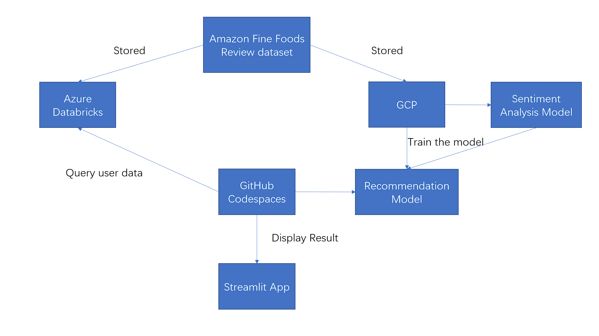

## Amazon Food Recommendation

This project trains a Neural Network model with sentiment analysis to provide customers with food recommendations, based on their purchase and review history. The dataset is then deployed on Azure Databricks for query.

## Flow Chart



## Databricks


### Setup Auth

Place Databricks' authentication information in CodeSpaces secrets.

```shell
DATABRICKS_HOST
DATABRICKS_HTTP_PATH
DATABRICKS_SERVER_HOSTNAME
DATABRICKS_TOKEN
```

### Test out CLI

```shell
databricks clusters list --output JSON | jq
databricks fs ls dbfs:/
databricks jobs list --output JSON | jq
```

### Remote connect

[databricks-connect](https://docs.databricks.com/dev-tools/databricks-connect.html)


### Databricks SQL Connector

[Setup table first!](https://docs.databricks.com/dbfs/databricks-datasets.html)

[sql remote](https://docs.databricks.com/dev-tools/python-sql-connector.html)


## Data

This project makes use of the Amazon Fine Foods Review dataset. This consists of 10 data fields and ~568,000 records. This app utilizes the following records from the dataset: ProductId, UserId, Rate, and Preview.

[dataset](https://www.kaggle.com/datasets/snap/amazon-fine-food-reviews)

## Streamlit Example

```shel
streamlit run app.py
```


